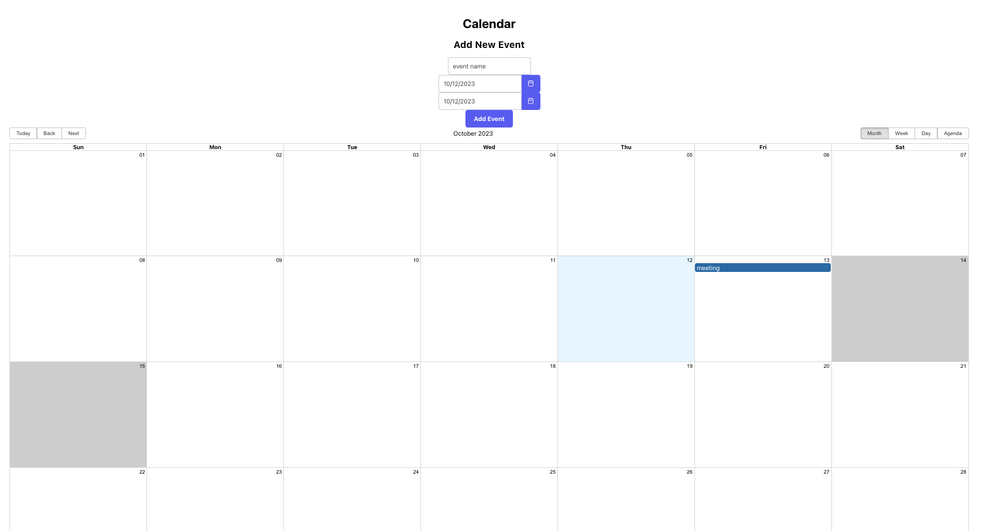

# Calendar App

Welcome to our interactive calendar application developed with React Big Calendar. Users have the flexibility to choose between Luxon and Moment.js localizers for a customized experience.

In the project directory, you can run:

### `npm start`

Runs the app in the development mode.\
Open [http://localhost:3000](http://localhost:3000) to view it in the browser.

